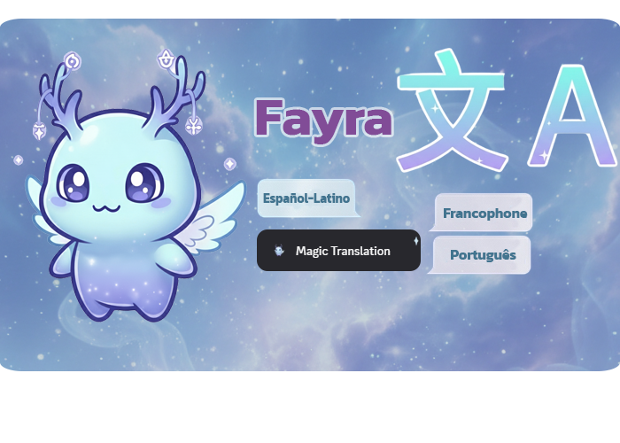

# Fayra-bot

Bot de **Discord** que traduce mensajes al instante desde el menú contextual (**Magic Translation**), pensado para comunidades que mezclan español, francés y portugués según el rol del usuario.

## Propósito

Reducir la barrera del idioma en un mismo canal: clic derecho sobre un mensaje → **Aplicaciones → Magic Translation**; la traducción se entrega de forma **solo visible para quien la solicita** (ephemeral).

## Tecnologías

| Área | Uso |
|------|-----|
| **Node.js** | Runtime |
| **discord.js v14** | Cliente, comandos de menú contextual, interacciones |
| **dotenv** | Configuración local (`DISCORD_*`, API de traducción) |
| **Keyv + SQLite** | Caché de traducciones con TTL |
| **franc** | Detección de idioma del texto |
| **node-fetch** | Llamadas HTTP a la API de traducción |
| **API compatible con Llama** (`llama3-8b-instruct`) | Traducción asistida por modelo |

## Configuración

1. `cp .env.example .env` (o copiar manual en Windows).
2. Completar variables (token del bot, `clientId` de la aplicación Discord, URL y clave del endpoint de traducción).
3. Registrar comandos: `node deploy-commands.js`
4. Ejecutar: `node index.js`

## Estructura relevante

- `index.js` — arranque del cliente y manejo de interacciones.
- `src/commands/translate.js` — lógica del menú contextual.
- `src/utils/translationService.js` — integración con la API de traducción.
- `src/config.js` — mapeo roles ↔ idiomas y nombre del comando.

## Licencia

ISC
